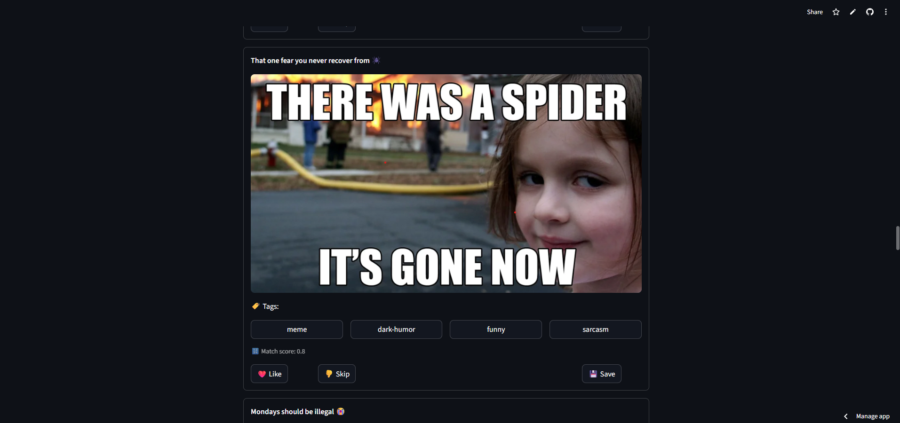
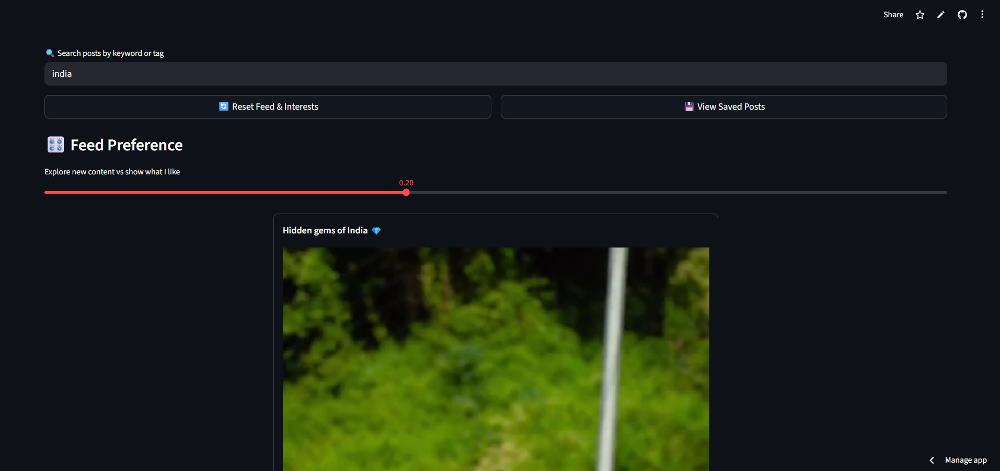
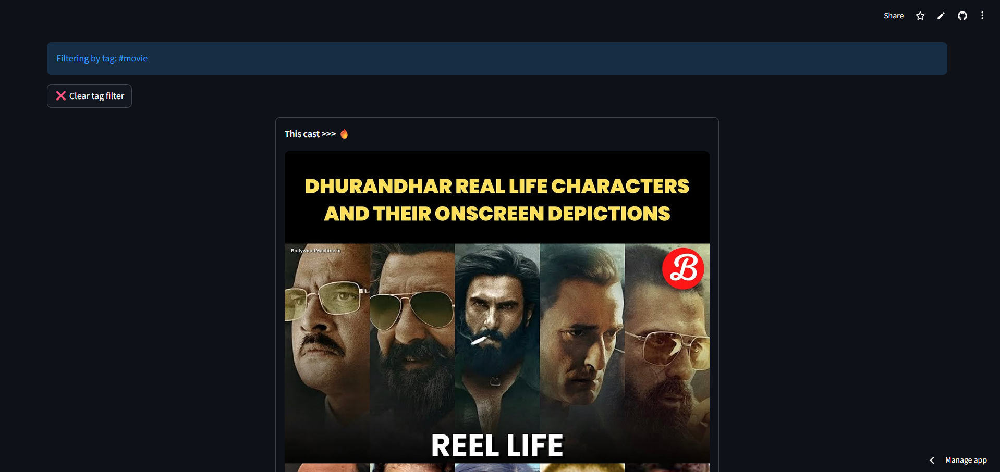
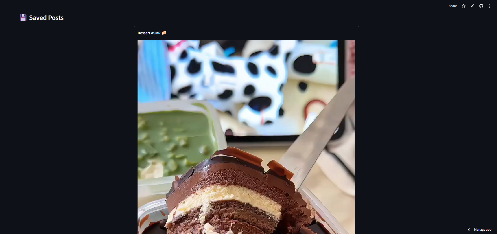

# SmartFeed AI – A Personalized Social Media Feed with Explainable AI

SmartFeed AI is an AI-powered personalized content feed inspired by social media platforms like Instagram and TikTok.
It learns your interests over time based on your actions (like, skip, save) and dynamically reorders the feed to show content you’re more likely to enjoy - while still keeping things fresh and diverse.

🔗 Live Demo 
👉 https://smartfeedai-aupjkcxwkrcdbu6jr4pefg.streamlit.app/

---

## Application Preview

Features

Liked Post

Interest Profile

Search by name

Filtering by Tags

Saved Post

Back to Feed

---

## Key Features:
## Personalized Feed Ranking :
- Posts are ranked based on your interest profile
- Interests increase when you like posts
- Interests decrease when you skip posts
- Older interests decay automatically over time

---

## Explore vs Personalization Control :
Slider to control:
- Showing familiar content (towards left)
- Exploring new/unseen topics (towards right)

---

## AI Explanations (LLM-powered) :
- Uses Groq + LLaMA 3.1
- Explains in simple words: “Why you are seeing this post”
- Friendly, direct, human-like explanations

---

## Tag-Based Interaction :
- Click any tag to instantly filter the feed
- Helps users understand what drives recommendations

---

## Save Posts :
- Save posts to view later
- Dedicated “Saved Posts” section

---

## Interest Profile Visualization :
- Shows your interest strength per tag 
- Confidence levels:
    🟢 Strong
    🟡 Medium
    🔴 Exploring
- Visual bar chart of interests

---

## How It Works :
- Each post has tags
- User actions affect tag scores:
    ❤️ Like → increases interest score
    👎 Skip → decreases interest score
- Feed ranking considers:
- Interest strength
- Confidence multiplier
- Novelty (new topics)
- Diversity penalty (avoid repetition)
- Interests decay over time if inactive
- AI explains recommendations using an LLM

---

## Tech Stack :
- Python
- Streamlit – frontend & app framework
- Groq API – LLM inference
- LLaMA 3.1 (8B Instant)
- Pandas – data visualization
- JSON – lightweight storage

---

## Project Structure
SmartFeedAI/
│
├── app.py                  # Main Streamlit app
├── recommender.py          # Ranking & interest logic
├── llm_utils.py            # Groq + LLM explanations
├── explanations.py         # Rule-based explanation breakdown
├── confidence.py           # Interest confidence levels
├── storage.py              # Load/save interests & saved posts
├── requirements.txt
│
├── assets/
│   └── posts/              # Images & videos used in feed
│
├── user_interests.json     # Stored user interest data
├── saved_posts.json        # Saved posts
│
└── .env                    # (NOT pushed) API keys

